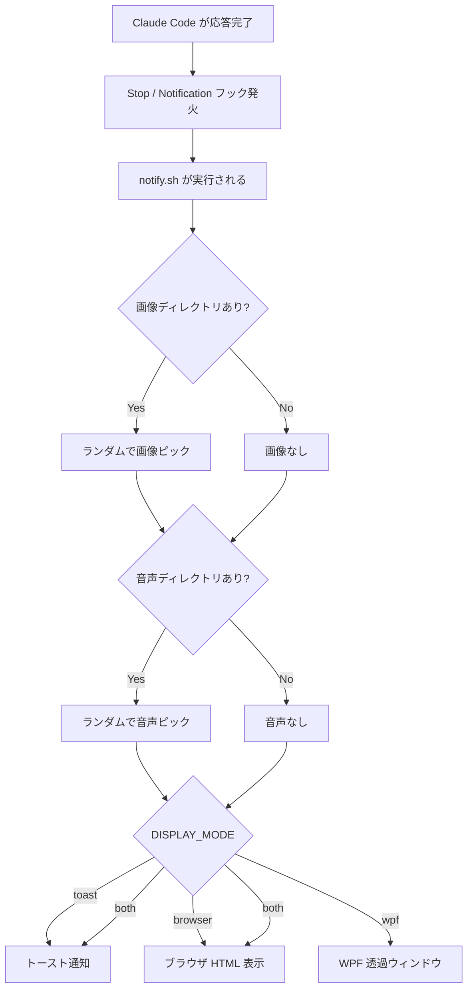
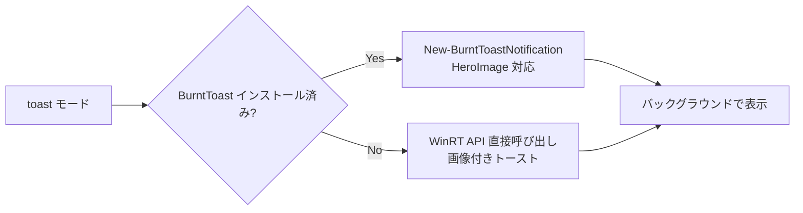
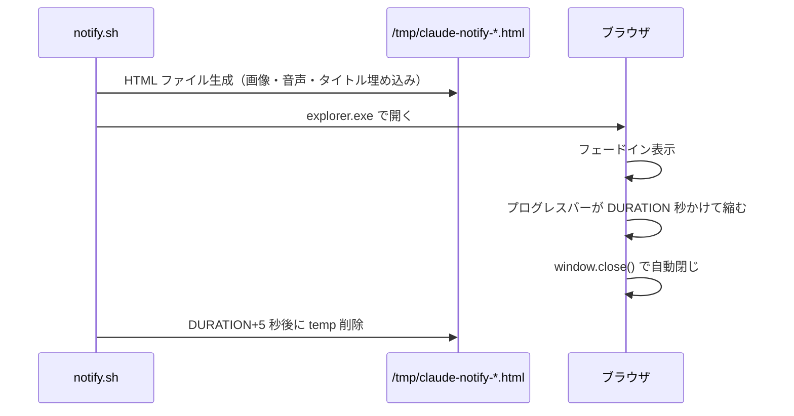
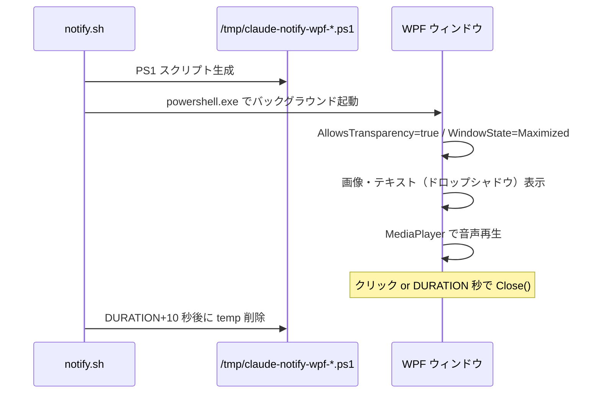
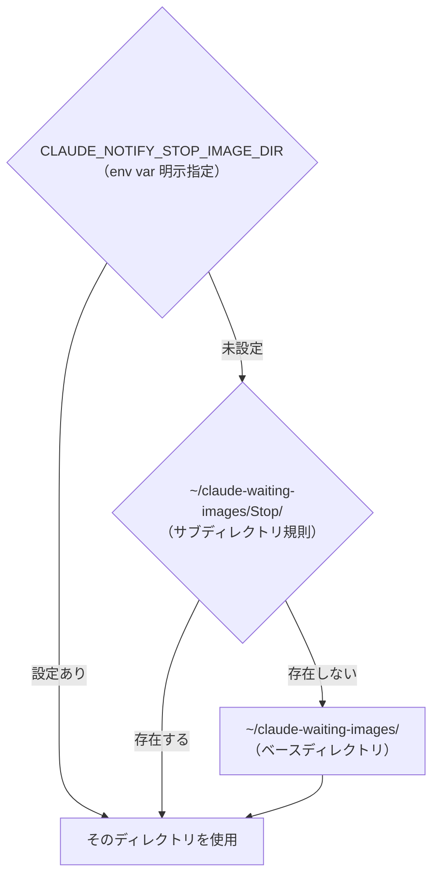

# stop-notifier

Claude Code が応答を完了してユーザーの入力待ちになったとき、WSL2 環境から Windows に通知を送るプラグイン。

画像・音声のランダム再生、3種類の表示モード、フックイベントごとの個別設定に対応。

---

## 動作フロー



---

## 表示モード詳細

### toast（デフォルト）

Windows のトースト通知を表示する。



### browser

一時 HTML ファイルを生成してデフォルトブラウザで開く。CSS アニメーション・GIF・音声の `<audio>` タグに対応。



### wpf

PowerShell + WPF で透過ウィンドウを全画面表示。背景が完全透明になり、画像だけが浮いて見える。



---

## 設定

環境変数で動作をカスタマイズできる。**イベント別設定が共通設定より優先される。**



**サブディレクトリ規則の使い方（ゼロコンフィグ）:**

```
~/claude-waiting-images/
├── Stop/           ← Stop イベント専用
│   └── waiting.gif
├── Notification/   ← Notification イベント専用
│   └── alert.png
└── default.png     ← イベント専用がなければこちら
```

### 共通設定

| 環境変数 | デフォルト | 説明 |
|---|---|---|
| `CLAUDE_NOTIFY_IMAGE_DIR` | `~/claude-waiting-images` | 画像ディレクトリ |
| `CLAUDE_NOTIFY_AUDIO_DIR` | `~/claude-waiting-sounds` | 音声ディレクトリ |
| `CLAUDE_NOTIFY_TITLE` | `Claude Code` | 通知タイトル |
| `CLAUDE_NOTIFY_TEXT` | `入力待ちです 👁` | 通知テキスト |
| `CLAUDE_NOTIFY_DISPLAY` | `toast` | 表示モード（`toast` / `browser` / `wpf` / `both`） |
| `CLAUDE_NOTIFY_DURATION` | `5` | 表示秒数 |
| `CLAUDE_NOTIFY_MPV_PATH` | `mpv.exe` | mpv.exe のパス |
| `CLAUDE_NOTIFY_CLICKTHROUGH` | `false` | wpf モードでクリックを透過するか |

### イベント別設定（例）

```bash
# Stop イベントだけ別の画像を使う
export CLAUDE_NOTIFY_STOP_IMAGE_DIR=~/stop-images
export CLAUDE_NOTIFY_STOP_TEXT="おつかれ！"

# Notification イベントは wpf モードで表示
export CLAUDE_NOTIFY_NOTIFICATION_DISPLAY=wpf
export CLAUDE_NOTIFY_NOTIFICATION_DURATION=8
```

---

## 対応ファイル形式

| 種別 | 形式 |
|---|---|
| 画像 | PNG / JPG / JPEG / GIF（アニメ GIF 対応） |
| 音声 | WAV / MP3 / M4A / OGG / FLAC |

---

## セットアップ

### 1. スクリプトのインストール

```bash
mkdir -p ~/.local/bin
cp scripts/notify.sh ~/.local/bin/claude-stop-notify
chmod +x ~/.local/bin/claude-stop-notify

# PATH に追加（未追加の場合）
echo 'export PATH="$HOME/.local/bin:$PATH"' >> ~/.bashrc
source ~/.bashrc
```

または `setup-stop-notifier` スキルを実行すると自動でセットアップされる。

### 2. BurntToast のインストール（toast モード推奨）

```bash
powershell.exe -NoProfile -c "Install-Module -Name BurntToast -Force -Scope CurrentUser"
```

### 3. mpv.exe のインストール（音声再生推奨）

```bash
# winget でインストール
powershell.exe -NoProfile -c "winget install mpv-player.mpv"

# または手動配置してパスを設定
export CLAUDE_NOTIFY_MPV_PATH="/mnt/c/tools/mpv/mpv.exe"
```

### 4. 画像・音声の配置

```bash
mkdir -p ~/claude-waiting-images
mkdir -p ~/claude-waiting-sounds

# 好きな画像・音声ファイルをそれぞれ置く
cp your-image.png ~/claude-waiting-images/
cp your-sound.wav ~/claude-waiting-sounds/
```

### 5. 動作確認

```bash
claude-stop-notify Stop
```

---

## 表示モード比較

| | toast | browser | wpf |
|---|:---:|:---:|:---:|
| 追加インストール | BurntToast（任意） | なし | なし |
| 透過背景 | ✗ | ✗ | ✅ |
| クリックスルー | ✗ | ✗ | ✅（オプション） |
| GIF アニメ | ✅ | ✅ | ✅ |
| 音声再生 | mpv / PS | `<audio>` タグ | MediaPlayer |
| 起動速度 | 速い | 速い | やや遅い（PS 起動） |
| カスタマイズ性 | 低 | CSS 自由 | WPF XAML |

---

## フックイベント

デフォルトで以下のイベントにフックが設定される。

| イベント | タイミング |
|---|---|
| `Stop` | Claude が応答を完了したとき |
| `Notification` | Claude から通知が届いたとき |

`hooks/hooks.json` を編集することで他のイベントも追加できる。
